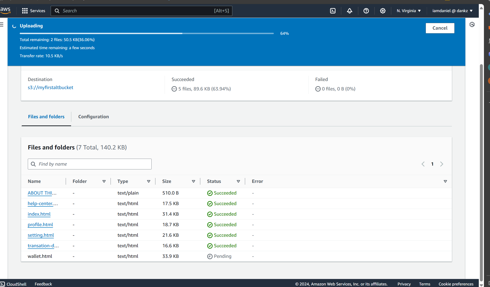
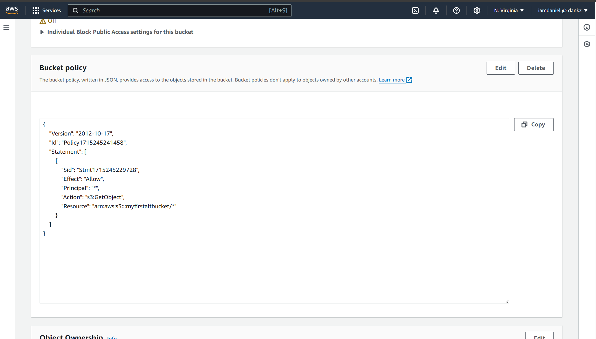
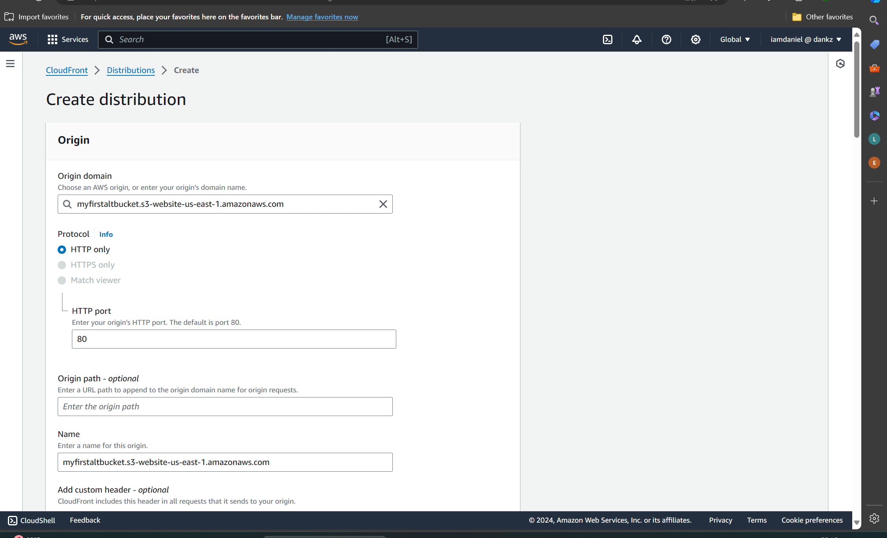

#### We upload files into s3 bucket 
#### Items uploaded 
#### We save and then enable static website hosting to be able to view the website directly through the s3 bucket link
#### S3 bucket policy 
#### S3 bucket website
#### We use cloudfront to deliver our content in the s3 bucket quicker 
#### We save and deploy the cloudfront service 
#### Our website through out cloudfront link 